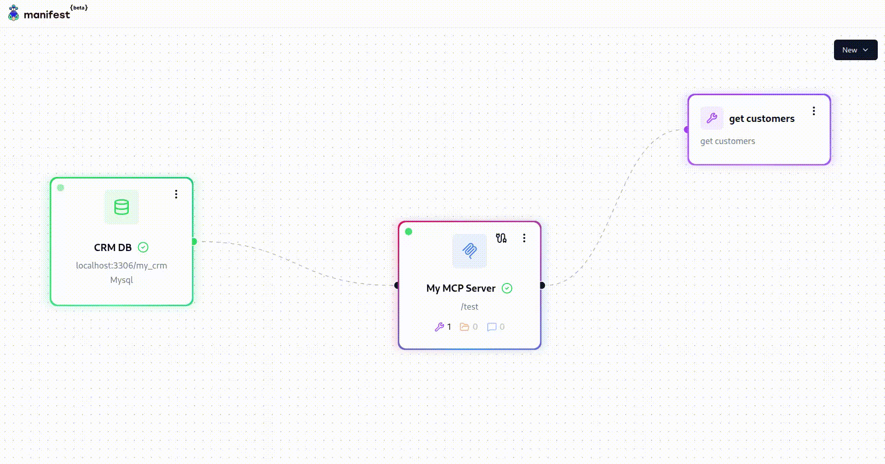

  
  

<strong>Manifest MCP Server Generator</strong>

> [!WARNING]
> 🚧 **Work In Progress.** This repo contains non-verified code. Do not use in production.

---

## Why an MCP Generator ?

Manifest MCP Generator helps developers to instantly create MCP servers to connect their datasource to AI agents.

Manifest is a fast and secure alternative to developing the plumbing manually yourself, which often takes time and can lead to unwanted sensitive data exposure.

## Key features:

- ⚡ **Instant MCP server generation** with tools, resources and prompts
- 🛡️ **Access control and governance** to secure and restrict access to your data
- 👁️ **Visual interface** to quickly understand what data you are exposing

## Current Status

Manifest MCP Generator is a Proof-Of-Concept. Here is the current status of the project:

| Feature                                                                                               | Status |
| ----------------------------------------------------------------------------------------------------- | ------ |
| Initial POC with MySQL connection and MCP server generation                                           | ✅     |
| Basic Tool generation that performs simple SQL queries                                                | ✅     |
| Basic Resource generation with upload to file storage                                                 | ✅     |
| Multiple datasource compatibility: PostgreSQL, SQLite, MongoDB, Excel, Snowflake, Databricks, APIs... | ❌     |
| MCP Authentication and access control management                                                      | ❌     |
| Complex tool creation with parameters and edge function calling                                       | ❌     |
| Instant self-hosted plug and play Docker Container                                                    | ❌     |

## Want to give us a hand? 💗

- Give us your brutally honest feedback on [GitHub discussions](https://github.com/mnfst/mcp-server-generator/discussions)
- Write us at bljkicfg1@mozmail.com to talk. We would love to connect!

## Demo video

